<!-- ============================ HEADER ============================ -->

<p align="center">
  
</p>

<p align="center">
  
</p>

<p align="center">
  
</p>

<h3 align="center">Backend Developer building scalable systems with Java & Spring Boot ☕</h3>

<p align="center">
  <a href="https://www.linkedin.com/in/rohit-bisht-078642379/">
    
  </a>
  <a href="mailto:rohitbishtt69@gmail.com">
    
  </a>
  <a href="https://leetcode.com/u/rohit316/">
    
  </a>
  <a href="https://github.com/lieutenant-Rohit">
    
  </a>
</p>

<p align="center">
  
  
</p>

---

# 💫 About Me

I'm an MCA student who likes turning ideas into working backend systems — from a Git-like version control tool built from scratch, to a REST API that detects coordinated bot activity on social media. Java and Spring Boot are home base; PostgreSQL, MongoDB, and Docker are how things actually ship.

```java
public class RohitBisht {

    String role = "Backend Developer";
    String education = "Master of Computer Applications (MCA)";

    String[] expertise = {
        "Java",
        "Spring Boot",
        "REST APIs",
        "PostgreSQL",
        "MongoDB"
    };

    String[] currentlyLearning = {
        "Microservices",
        "System Design",
        "Software Testing",
        "Operating Systems",
        "DBMS",
        "Computer Networks"
    };

    String[] interests = {
        "Data Structures & Algorithms",
        "Reading Novels",
        "Swimming & Badminton",
        "Geopolitics"
    };

    String motto = "Code. Learn. Build. Repeat.";
}
```

- 🎓 MCA student focused on **backend engineering** & distributed systems
- ☕ Building scalable applications with **Java & Spring Boot**
- 🧠 Currently deepening my grip on **System Design, Microservices & OS/DBMS** fundamentals
- 📈 Solving **LeetCode** problems, consistently
- 🌱 Always shipping something new
- 🤝 Open to collaborating on backend & Java projects

---

# ⚡ Tech Stack

<p align="center">

</p>

<p align="center">

</p>

---

# 🏆 GitHub Trophies

<p align="center">

</p>

---

# 💻 LeetCode

<p align="center">
<a href="https://leetcode.com/u/rohit316/">

</a>
</p>

---

# 📊 GitHub Statistics

<p align="center">

</p>

<p align="center">

</p>

---

# 📈 Contribution Graph

<p align="center">

</p>

---

# 🤝 Let's Connect

<p align="center">
<a href="mailto:rohitbishtt69@gmail.com">

</a>
<a href="https://www.linkedin.com/in/rohit-bisht-078642379/">

</a>
<a href="https://leetcode.com/u/rohit316/">

</a>
</p>

---

<p align="center">
<i>"Programs must be written for people to read, and only incidentally for machines to execute."</i><br/>
<b>— Harold Abelson</b>
</p>

---

<p align="center">

</p>
